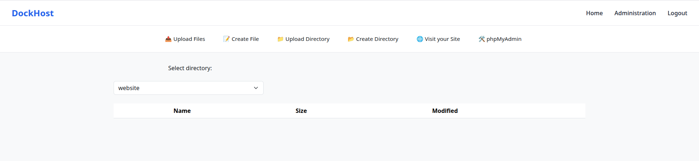
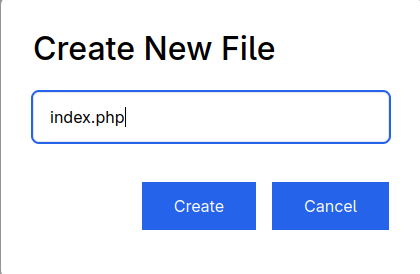

## HOST from where we launch ansible
- Install ansible-core
- Install ansible-galaxy collection install community.docker

# 📦 DockHost

DockHost is an automated web hosting platform developed using Docker container
technologies. Its main goal is to provide users with an isolated, secure, and self-
managed web hosting environment without requiring advanced system
administration knowledge.


---

## ✨ Features

- ⚡ Fast
- 🔒 Secure 
- 🔧 Easy to deploy and configure

---

## 📁 Directory Structure

```
DockHost
├── autoDockerUp
│   └── docker-compose-watch.service
├── docker
│   └── main
│       ├── nginxContainer
│       │   └── website
│       │       ├── includes
│       │       │   ├── classes
│       │       │   │   ├── login.class.php
│       │       │   │   ├── user_account.class.php
│       │       │   │   └── user_website_setup.class.php
│       │       │   ├── db
│       │       │   │   └── db.php
│       │       │   ├── functions
│       │       │   │   └── csrf.php
│       │       │   └── navbars
│       │       │       └── links_navbar.php
│       │       └── public
│       │           ├── admin.php
│       │           ├── create_account.php
│       │           ├── css
│       │           │   └── style.css
│       │           ├── index.php
│       │           ├── js
│       │           │   └── register.js
│       │           ├── login.php
│       │           ├── logout.php
│       │           └── setup_site.php
│       └── php-fpmConf
│           ├── dockerfile
│           └── php.ini
├── installation.sh
├── LICENSE
├── main.yml
├── playbooks
│   ├── autoDockerUp.yaml
│   ├── docker.yaml
│   └── packages.yaml
└── README.md
```

---

## 🚀 Getting Started

### Prerequisites

#### Host to install the project
I'm running Arch Linux so all the commands are adapted to it. If you are running a different distro, you must adapt the installation commands.

- Install the package ansible-core (version tested 2.18.6)

```bash
pacman -S ansible-core
```

- Install apache/httpd (version tested 2.18.6).
htpasswd is needed to generate the password for the filemanager

```bash
pacman -S httpd
```

- Install community.docker package for ansible using

```bash
ansible-galaxy collection install community.docker
```

#### Server where DockHost will be installed

- Ubuntu Server/Desktop/LXC Virtual Machine (tested in LXC running Ubuntu 24.04.2 LTS x86_64)

- Virtualization activated (if running the project in a LXC, activate nesting, needed for docker)

- At least 4GB of RAM and 10GB of storage free (to run a few websites)

- SSH connection

- User with superuser permissions

- Fixed IP public address or Dynamic DNS service configured to deal with public IP changes(not in this project scope)

#### Domain Requirements

- A domain is needed.

- A wildcard certificate for the domain. You can generate it using certbot too

### Deployment and installation

1. Download the repo

```bash
git clone --depth 1 https://github.com/egenerei/DockHost.git 
cd DockHost
```

2. Give execution permissions to installation.sh

```bash
sudo chmod +x ./installation.sh
```

3. Execute installation.sh to configure the deployment files needed

- installation.sh will generate the files needed for your own configuration.

```bash
/bin/bash ./installation.sh
```
- 1. installation.sh will check if you have ansible-core, the community.docker plugin for ansible and apache/httpd


- 2. Then it will ask you to enter the SSH configuration parameters needed


- 3. Enter the credentials for the filemanager to administrate the DockHost files


- 4. Domain settings

Enter your domain and then the ABSOLUTE PATH to you certificate and private key files


4. Now execute the main.yml playbook using

```bash
ansible-playbook main.yml
```

If it fails because your ssh public key is not in the server/public key authentication is deactivated, to enter the superuser's (the one indicated in installation.sh) password, use

```bash
ansible-playbook main.yml -K
```

---

## 🧪 Usage

### Administrator

After deploying the project, navigate to your domain. (you can see my server running it at https://dockhost.online)

- To administrate the files, logs etc, go to your domain/files (e.g. example.org/files) and use the credentials you indicated in installation.sh

- This is your dashboard


- In clients, you'll find all the files related to each client/website.


- In db_files, you'll find the sqlite database file where user data gets registered


- In logs you'll find logs, generated by the server and the main nginx webserver as well


- In website, you'll have access to the website where dockhost is presented.


### Clients

As a client you must first register using the Register form. 


This first form creates you user.


The second form will configurate your subdomain and database password access (remember you have a full fledged MariaDB accessible only through the website you host in DockHost)


After registering correctly, you'll be presented with your administration panel. Here you can upload or create the the files/directories for your website.




If you decide to create a file, you will be presented with a test editor built-in the website.



Write and hit Save at the bottom


Once the Save is confirmed, exit the file editor and navigate to your subdomain.domain.whatever. You may use the **Visit your Site** link in the Administration panel.


To access phpmyadmin, just type your website subdomain.domain.whatever/phpmyadmin and use

- User: **root**
- Password: **password-set-in-website-config-form**


To access mariadb for php, create a pdo object in a document inside your website with these settings:

- User: **root**
- Password: **password-set-in-website-config-form**
- Server: **mariadbyoursubdomain**
- Port (not needed): **3306**


---

## 🛠️ Technologies

- Main docker infrastucture uses NGINX, filebrowser and PHP-FPM containers + SQLite as a database for users
- Each client registered gets APACHE, MariaDB, PHPMyAdmin containers to be able to deploy real-world web apps.

---

## 📜 License


Read the [LICENSE file](./LICENSE)

---

## 👤 Author

**Jorge Del Rey Prieto**  
[github.com/egenerei](https://github.com/egenerei)  

---

## 📫 Contact

For support or business inquiries: [jdrp.github@gmail.com](mailto:jdrp.github@gmail.com)
